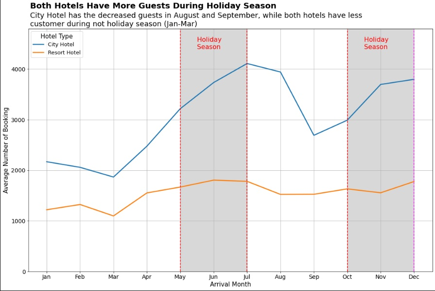
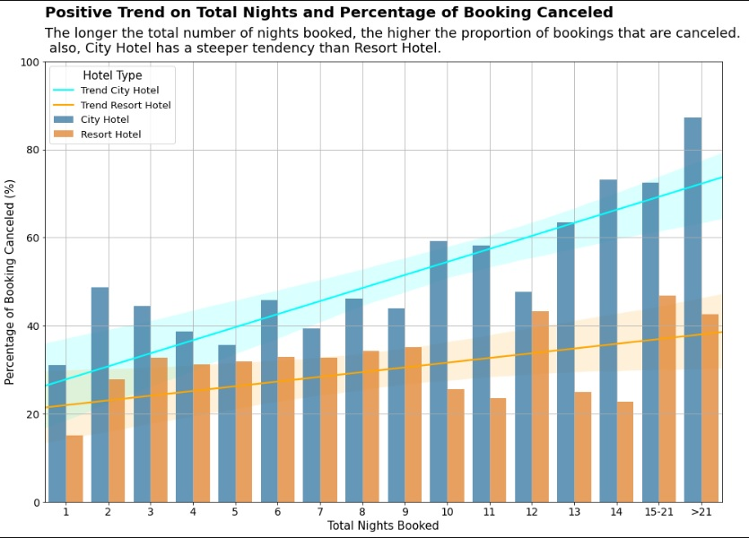
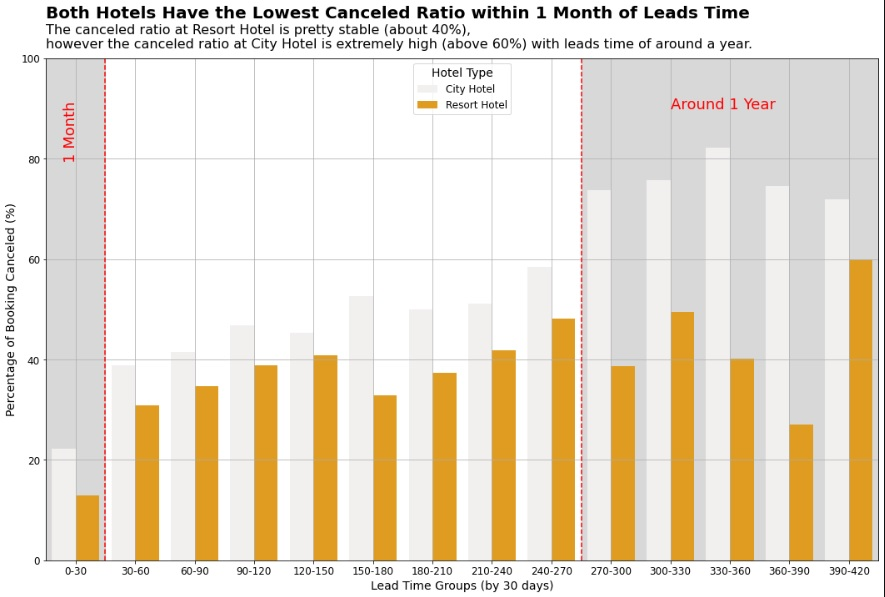

# Hotel-Booking-Analysis

# Problem Statement & Objective

In this analysis, i want to analyze hotel booking performance, the hotel wants to improve hotel performance by analyzing data from the previous year. This analysis is important because the hotel wants to choose the right policy to reduce the rate of customers canceling orders.

# Problem Questions

This analysis is divided into three sections. 
1. Does the time of month affect bookings cancellations?. 
2.  How much impact does the amount of booked nights have on booking cancellations?
3.  How much impact does lead time have on booking cancellations??
	
# Data and Assumption

The Hotel has 119390 customers data, according to previous year's data. This analysis may have an impact on hotel cancellations and the formulation of the best approach to reduce the rate of hotel cancellation bookings by consumers.

# Analysis
**Data Preprocessing**
 - There are `119390 rows` in all, including the following information: The data has `8 categorical` and `22 numerical` features
 - We can fill in the  `Children`  column with the number 0 describing the absence of children in the hotel booking data
-   We can fill in the  `city`  column with "unknown" because the country of origin of the hotel booker is unknown
-   `agent`  &  `company`  : impute with a value of 0 because the minimum values are 1 and 6, also avoiding wrong assumptions
-   Create total guest data, namely the number of `adults`, `children,` and `babies`
-   delete data that has `0` guests.

**Analysis of the time of month by Hotel Type** 
- Create **aggregation** data to calculate the number of `hotel bookings` per `month` by `hotel type`
- **normalization** to get the **average** number of orders in a `month` in different`years`
-  Sort data by `month`	

insight found:
Due to the ending of the holiday season, City Hotel have seen a significant drop in August and September. This indicates that the holiday season has a significant impact on the hotel cancellation rate. However, the increase in the booking rate is during the holiday season. Resort hotels appear to be having the same issue, but the pace of growth and fall is less drastic and more stable. 

**Analysis impact does the amount of booked nights have on booking cancellations**

 - **Aggregating** data to get duration of `stay` based on `hotel type`
 - **grouping** data based on observations of data distribution
 

insight found: 
The longer the total number of nights booked, the higher the proportion of bookings that are canceled.  also, City Hotel has a steeper tendency than Resort Hotel.  This can indicate that there is customer dissatisfaction with hotel services.

**Analysis of the Lead time on Hotel Booking Cancellation Rate**

 - Categorize the `lead_time` column to make it simpler
 - Implement data **aggregation** to calculating the amount of bookings based on the created `lead tim`e group and `hotel type`
 
 
 
insight found:
The canceled ratio at Resort Hotel is pretty stable (about 40%), however the canceled ratio at City Hotel is extremely high (above 60%) with leads time of around a year.  The higher the booking length, the more probably customers are to cancel the booking. However, the lesser the order length, the lower the chance of cancellation.

# Conclusion

Many factors are affecting hotel booking cancellations. What I discovered indicated that the holiday season, duration of stay, and distance of bookings all had an impact on hotel cancellations. Analysis of the time of month shows that bookings increase during the holiday season, but then fall sharply after the season ends. The longer the stay, more higher the chance of cancellation. This can be impacted by various external or internal factors, such as the hotel it's self or the consumer, but data limits prevent me from analyzing more. the booking distance, which is linearly related to the longer the distance of the reservation, the greater the possibility of hotel cancellations.

# Recommendations

According to the findings of my analysis, time is the most crucial factor affecting the cancellation rate of hotel reservations. It is highly probable that they will receive more profit if you use it wisely.
**action point**:
- Launch a campaign immediately prior to the holiday season, with interesting promotions such as holiday season bundles, etc.
- Give special treatment to consumers that book a high number of nights, such as discounts.
 - Paying attention to the distance of the duration of the stay, the hotel should set a time restriction so that the customer does not order for a longer length of time, and requires the customer to pay in front with a little amount to avoid cancellation.
